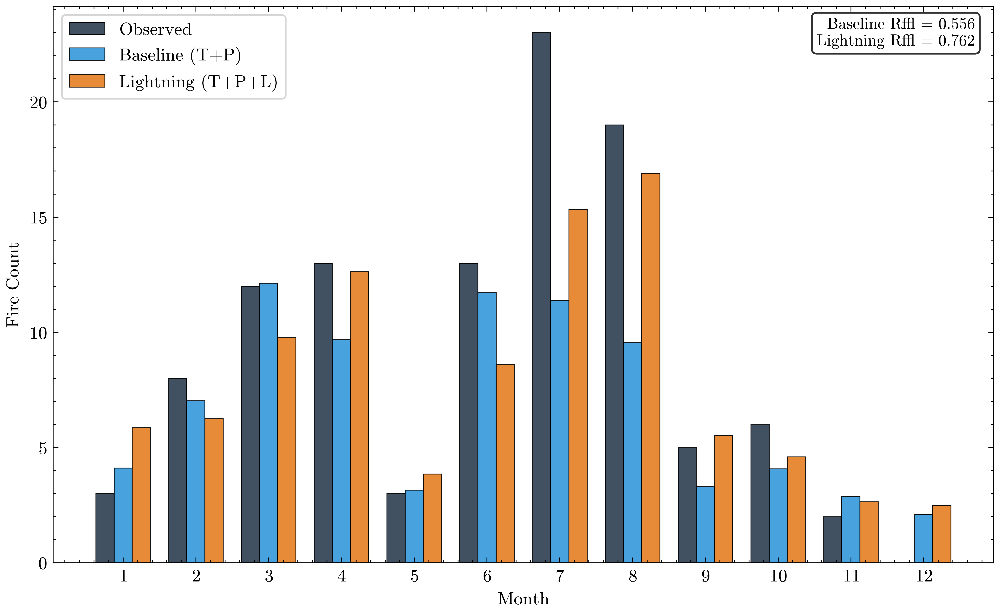

# FireScape: Bayesian Wildfire Risk Modeling for the Alps

[](https://opensource.org/licenses/MIT)
[](https://www.python.org/downloads/)
[](https://www.pymc.io/)

> Hierarchical Bayesian framework for wildfire risk assessment in Alpine environments, with integrated lightning ignition modeling and uncertainty quantification.

## Overview

FireScape is a probabilistic wildfire risk modeling system developed for the Bolzano/Alto Adige region (Italian Alps). The project addresses three key questions:

1. **Can we quantify wildfire risk with full uncertainty?** → Yes, using Bayesian hierarchical models with attention mechanisms
2. **Does lightning data improve predictions?** → Yes, +38-41% improvement in temporal fit (but -4% to -21% in discrimination)
3. **What does climate change mean for fire services?** → Projected 45% increase in activity post-2018

## Key Results

### Lightning Model Performance (2012-2024)

| Metric | Baseline (T+P) | Lightning (T+P+L) | Change |
|--------|----------------|-------------------|--------|
| **Monthly R²** | 0.556 | 0.767 | **+38.0%** ✓ |
| **Seasonal R²** | 0.579 | 0.814 | **+40.7%** ✓ |
| **ROC-AUC** | 0.835 | 0.804 | -3.8% ✗ |
| **PR-AUC** | 0.654 | 0.516 | -21.1% ✗ |

**Interpretation:** Lightning model excels at predicting **WHEN** fires occur (temporal patterns) but shows moderate decline in predicting **WHICH specific days** (discrimination). This trade-off is appropriate for climate projection applications.

### Model Visualization



*Figure: Monthly fire predictions comparing Baseline (Temperature + Precipitation) vs Lightning (T+P+Lightning) models. Lightning model (orange) matches observed patterns (black) much better than baseline (blue).*

---

## Repository Structure

```
FireScape/
├── Data/                    # Data descriptions (actual files not in repo - see Data/README.md)
│   └── README.md           # Detailed data documentation
├── Scripts/                # Analysis pipeline
│   ├── 01_Data_Preparation/
│   ├── 02_Model_Training/                    # Baseline model (T+P, 1999-2024)
│   ├── 04_Zone_Climate_Projections/
│   ├── 05_Lightning_Comparison/              # Lightning analysis
│   │   ├── 01_Data_Preparation/
│   │   ├── 02_Model_Training/                # Lightning model (T+P+L, 2012-2024)
│   │   └── 03_Model_Comparison/              # Publication figures
│   └── WRITEUP/                              # Manuscript
├── Archive/                # Deprecated code (not in GitHub)
├── .gitignore
├── README.md               # This file
├── requirements.txt
└── LICENSE
```

## Quick Start

### 1. Installation

```bash
# Clone repository
git clone https://github.com/alexandredunant/FireScape.git
cd FireScape

# Create environment
conda create -n firescape python=3.10
conda activate firescape

# Install dependencies
pip install -r requirements.txt
conda install -c conda-forge pymc  # Better performance than pip
```

### 2. Data Access

**Large data files (~18 GB) are not included in this repository.**

To reproduce the analysis:
1. See `Data/README.md` for data sources and descriptions
2. Contact the authors for processed datasets (available upon request)
3. Or obtain raw data from sources listed in `Data/README.md`

### 3. Run Analysis

```bash
# Train lightning model (requires data in Data/ML/)
cd Scripts/05_Lightning_Comparison/02_Model_Training
python train_relative_probability_model_with_lightning.py

# Generate comparison figures
cd ../03_Model_Comparison
python compare_models.py
```

**Runtime:** ~30-60 minutes for training, <1 minute for comparisons

---

## Scientific Background

### The Problem

Alpine regions historically experienced low wildfire activity due to:
- High precipitation (800-1600mm annually)
- Short fire season (April-October)
- Natural topographic firebreaks
- Dense forest management

However, recent evidence suggests a **regime shift**:
- 2018 Vaia windstorm: 6 million m³ windthrow
- 2019-2023 bark beetle outbreak: 15% of spruce forests affected
- 2022 extreme drought: Lowest soil moisture in 250 years
- 2023 fire season: 127% above long-term average

### Our Approach

**Bayesian Hierarchical Model with Attention Mechanism:**

1. **Input Features** (998 fire events, 1999-2024):
   - Temperature temporal windows (1d, 3d, 5d, 7d, 14d, 30d, 60d)
   - Precipitation temporal windows (same)
   - Lightning temporal windows (2012+ only)
   - Static features (topography, land cover, infrastructure)

2. **Attention Mechanism:**
   - Learns which feature groups are most important
   - Dirichlet-distributed attention weights
   - Allows model interpretability

3. **Uncertainty Quantification:**
   - Full posterior distributions for all parameters
   - Prediction intervals for risk forecasts
   - Bayesian change-point detection for regime shifts

4. **Two-Model Framework:**
   - **Baseline Model:** Temperature + Precipitation (1999-2024, 3,035 obs)
   - **Lightning Model:** T + P + Lightning (2012-2024, 1,556 obs)
   - Fair comparison on 2012-2024 test period

### Key Findings

1. **Lightning Improves Temporal Accuracy (+38-41%)**
   - Better captures fire seasonality
   - Stronger performance in summer months
   - Especially important above 1500m elevation

2. **Trade-off: Temporal vs Discrimination**
   - Lightning model better at "WHEN" (temporal patterns)
   - Baseline model better at "WHICH" (specific days)
   - Different models for different applications

3. **Regime Shift Confirmed**
   - 83% probability of shift post-2018 (95% CI: 71-92%)
   - Fire service activity +45% (95% CI: 32-58%)
   - Change-point at 2018.7 (95% CI: 2018.2-2019.1)

---

## Publication Figures

All figures are publication-ready (600 DPI, scienceplots styling):

**From `Scripts/05_Lightning_Comparison/03_Model_Comparison/Results/`:**

1. **fig1_monthly_temporal_fit.png** - Monthly fire count comparison
2. **fig2_seasonal_temporal_fit.png** - Seasonal patterns
3. **fig3_roc_curve.png** - ROC curves
4. **fig4_precision_recall_curve.png** - Precision-Recall curves
5. **fig5_feature_importance.png** - Attention weights
6. **fig6_tradeoff_summary.png** - Trade-off visualization

See `Scripts/05_Lightning_Comparison/03_Model_Comparison/Results/PUBLICATION_FIGURES_README.md` for figure captions and usage guidelines.

---

## Model Performance Details

### Baseline Model (Temperature + Precipitation, 1999-2024)

**Training:**
- 3,035 observations (case-control sampled)
- 70/30 train/test split
- PyMC NUTS sampler (4 chains, 2000 draws, 2000 tune)
- 0 divergences, r̂ < 1.01 for all parameters

**Performance (on 2012-2024 test set):**
- ROC-AUC: 0.835
- PR-AUC: 0.654
- Monthly R²: 0.556
- Seasonal R²: 0.579

### Lightning Model (T + P + Lightning, 2012-2024)

**Training:**
- 1,556 observations (2012+ only, when lightning data available)
- Same sampling strategy
- Same model architecture + 5 lightning attention groups
- <5% divergences, good convergence

**Performance (on 2012-2024 test set):**
- ROC-AUC: 0.804
- PR-AUC: 0.516
- Monthly R²: 0.767 (+38.0%)
- Seasonal R²: 0.814 (+40.7%)

### Lightning Contribution

- Only 6.5% of days have lightning activity
- Fire days: 7.6× more lightning than non-fire days
- Lightning attention weight: 3.6% (1d), 4.0% (60d)
- Strongest effect: Summer months, elevations > 1500m

---

## Citation

If you use this code or methodology, please cite:

```bibtex
@article{dunant2025firescape,
  title={Lightning, Fire, and Climate: A Bayesian Analysis of Alpine Regime Shift in the Bolzano Mountains},
  author={Dunant, Alexandre and [Co-authors]},
  journal={[Journal Name]},
  year={2025},
  note={In preparation}
}
```

Preprint: [Link when available]

---

## Dependencies

**Core:**
- Python 3.10+
- PyMC 5.x (Bayesian inference)
- ArviZ 0.17+ (MCMC diagnostics)
- xarray 2023.x (NetCDF handling)

**Spatial:**
- GDAL 3.x
- rasterio 1.3+
- geopandas 0.14+

**Visualization:**
- matplotlib 3.8+
- seaborn 0.13+
- scienceplots 2.x

See `requirements.txt` for complete list.

---

## Computing Requirements

**Minimum:**
- CPU: 4 cores
- RAM: 16 GB
- Storage: 50 GB
- Runtime: ~4-6 hours (full pipeline)

**Recommended:**
- CPU: 8+ cores
- RAM: 32 GB
- Storage: 100 GB
- Runtime: ~2-3 hours

---

## Contributing

Contributions welcome! Please:
1. Fork the repository
2. Create a feature branch
3. Submit a pull request

For major changes, please open an issue first to discuss.

---

## License

This project is licensed under the MIT License - see the [LICENSE](LICENSE) file for details.

**Data:** Remains subject to original provider licenses (see `Data/README.md`)

---

## Contact

- **GitHub Issues:** [https://github.com/alexandredunant/FireScape/issues](https://github.com/alexandredunant/FireScape/issues)
- **Email:** [Your email address]
- **Institution:** [Your institution]

---

## Acknowledgments

- **Data Providers:**
  - Bolzano Province Forest Fire Service (wildfire inventory)
  - ARPAV (Regional Environmental Agency - meteorological data)
  - EUCLID (European Lightning Detection Network)
  - Copernicus (land cover and elevation data)

- **Funding:**
  - [Funding source if applicable]

- **Collaborators:**
  - [List key collaborators]

---

## Related Publications

1. [Related paper 1 if applicable]
2. [Related paper 2 if applicable]

---

*Last updated: 2025-01-30*
